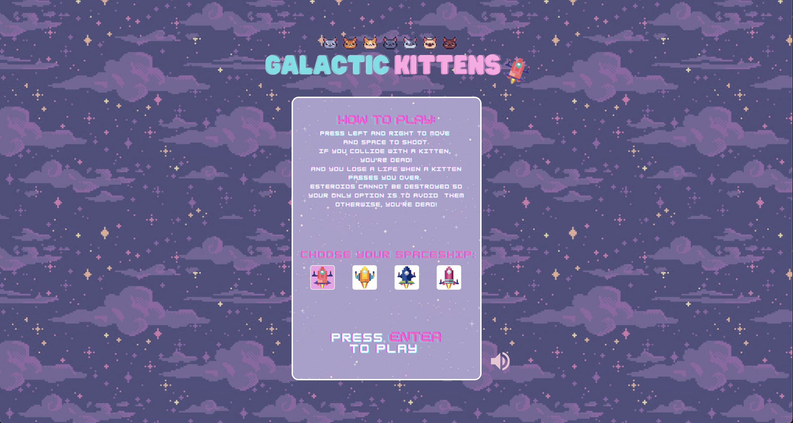
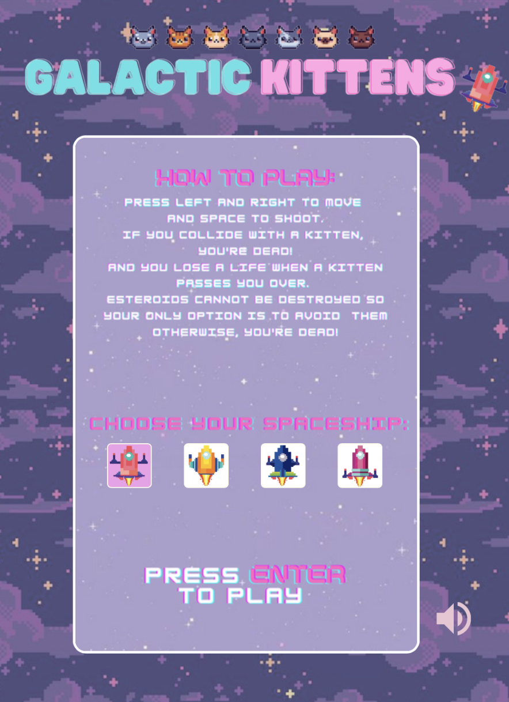
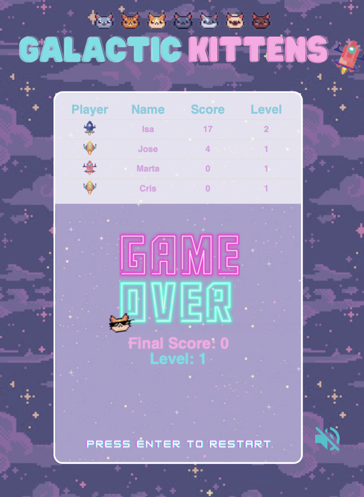
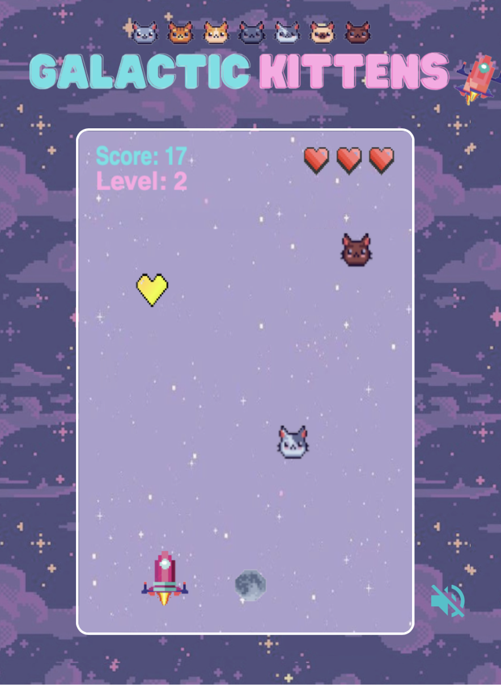
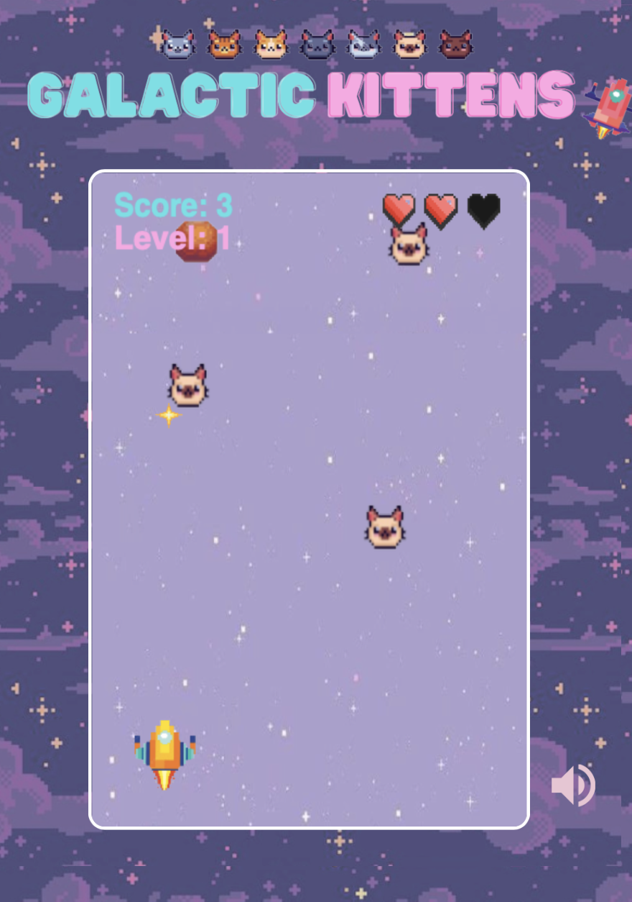

Galactic Kittens is a browser game where you'll have to save the galaxy by destroying the cute yet evil kittens that come up your way, while you also avoid getting hit by asteroids. The whole galaxy depends on you! ✨

Technologies used: Canvas, HTML, CSS, JS (ES6), OOP

 
 

<h2>Gallery</h2>

